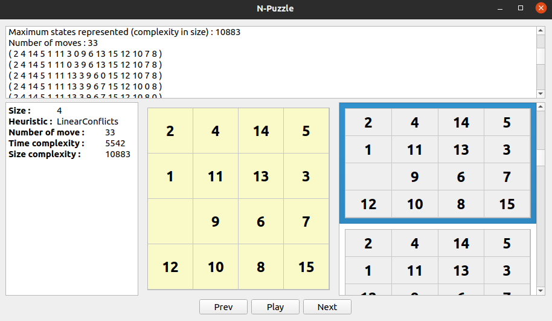

# N-Puzzle using A-star algorithm

This is a project for testing A-Star algorithm in a N-Puzzle context.

It is developed in C++ for Linux environment (tested on Ubuntu 20.04 and Xubuntu 18.04)

It also provid a User Interface develpoed in Python with Qt for Python.



## A-Star

This is a first-best-find algorithm usually use as pathfinding in video games.

It will find the shorest path between two point. Here we use it to find the way between two state. The state of the grid given as input at the begining of the program, and the goal state wich is the grid resolved.

It use Heuristic functions wich will calculate a theoric cost to go from the actual state to the goal state.

## Heuristics

All heuristics used in this project are admissible, i.e. they never overestimate the cost of reaching the goal.
In this project we implement the following heuristic functions:

### Hamming

This heuristic counts all the misplaced tiles on a state, compared to the goal state.

The given grid:
```
1 2 3
8 4  
5 6 7
```
has a cost of 3 to reach the final state:
```
1 2 3
8   4
7 6 5
```
(tiles 4, 5, 7 are misplaced)


### Manhattan distance

This algorithm does the addition of the moves from all misplaced tiles to their goal place, without taking into account the tiles on their way.

The given grid :
```
1 2 3
4 5  
6 7 8
```

has a cost of 1 to reach the final state :
```
1 2 3
4   5
6 7 8
```

This one  :
```
1 3  
4 5 2 
6 7 8
```

has a cost of 4 to reach the final state :
```
1 2 3
4   5
6 7 8
```
(tile 2 has to do two moves, tiles 3 and 5 have to do one move each)


### Linear Conflicts

This algorithm calculates the Manhattan Distance of each tile (the number of moves in the path from a tile to its goal), and adds the number of conflicts that may appear on that path.

Two tiles A and B are in linear conflict if :
 - they are on the same line
 - their goal positions also are on this line
 - A is to the right of B, and the goal position of A is to the left of the goal position of B.

For each line and column of the grid, we look for tiles in conflict, and add a cost of 2 for each conflicting pair.

When 3 or more tiles are in linear conflict, we pick the tile involved in the most conflicts to move first. This way we can minimize the number of additional moves, and the heuristic stays admissible.

The given grid:
```
3 1 2
8   4
7 6 5
```
has a cost of 6 to reach the final state:
```
1 2 3
8   4
7 6 5
```
Manhattan distance = 4 (tile 3 moves two times, tile 1 moves one time, tile 2 moves one time) 
   +
1 conflict * 2 (tile 3 conflicts with tiles 1 and 2. So we move 3 first in order to avoid extra moves)
  = 6

# Performance

This project work perfectly on 3x3 size puzzle. Give a result under 1sec so far.

However, performance will decrease quickly with more complicated map (4, 5...) and with the degree of randomisation of starting puzzle state.


# Run

```
make
./n-puzzle -h
```

To read puzzle from a map. (See help to know the right format)
```
make
./n-puzzle -f file
```

To let the program generate a random 8-puzzle (size 3x3)
```
make
./n-puzzle -g 3
```

# User Interface

This project provide a user interface using Qt for Python. Sadly you may not be able to run it depends of your distribution.

(Tested on Ubuntu 20.04. Do not work on Xubuntu 18.04, 18.04 do not have the GLibC version needed by Qt)

## Install dependencies
```
python3 -m venv env
source env/bin/activate
pip install pyside6
```

Run it with n-puzzle program
```
./n-puzzle -g 3 | python main_gui.py
```

# Authors
jdugoudr
MrgxF
